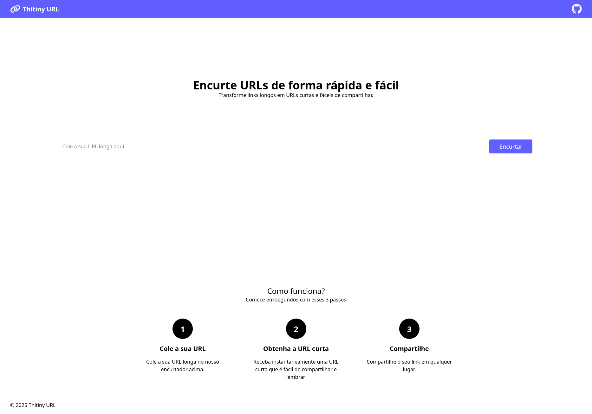

# Thitiny URL

Pequeno encurtador de URL desenvolvido para compor a nota parcial da disciplina de Desenvolvimento de Aplicações Backend com Framework, do curso de Sistemas para Internet, da UTFPR, campus Guarapuava.

Esta aplicação é um encurtador de URL simples, que permite aos usuários encurtar URLs longas e redirecionar para elas através de um identificador curto. Para isso, é somente necessário copiar e colar a URL longa no campo de entrada, clicar no botão "Encurtar" e, em seguida, copiar o link encurtado gerado.



# Especificidades

O projeto utiliza o framework [Laravel 12](https://laravel.com/docs/12.x), que é um framework PHP para desenvolvimento de aplicações web. Ele é construído com uma arquitetura MVC (Model-View-Controller) e utiliza o [Eloquent ORM](https://laravel.com/docs/12.x/eloquent) para interagir com o banco de dados, que é o PostgreSQL 17. Além disso, o projeto utiliza o [Blade](https://laravel.com/docs/12.x/blade) como motor de template para renderizar as views e o [TailwindCSS](https://tailwindcss.com/) para estilização.

# Módulos implementados

Para o desenvolvimento deste projeto, foi necessário seguir ao menos 5 módulos da disciplina, sendo escolhidos os seguintes:

1. Roteamento e Ciclo de Vida de uma Request
2. Views com Blade
3. Estilização com TailwindCSS
4. Forms e Validação de Requisições
5. Migrações e Relacionamentos

# Desenvolvimento

Para desenvolver este projeto, é necessário seguir alguns passos para executá-lo em ambiente de desenvolvimento.

## Requisitos

- PHP 8.4.7

## Executando

1. Clone o repositório:

```shell
git clone https://github.com/thiagotoyomoto/thitiny-url.git
cd thitiny-url
```

2. Instale as dependências do PHP e do JavaScript:

```shell
composer install
```

```shell
npm install
```

3. Crie um arquivo `.env` a partir do arquivo `.env.example`:

```shell
cp .env.example .env
```

4. Execute o Docker Compose para criar o banco de dados:

```shell
docker compose up -d
```


5. Execute o projeto:

```shell
composer dev
```

6. Acesse a URL:

```
http://localhost:8000
```
